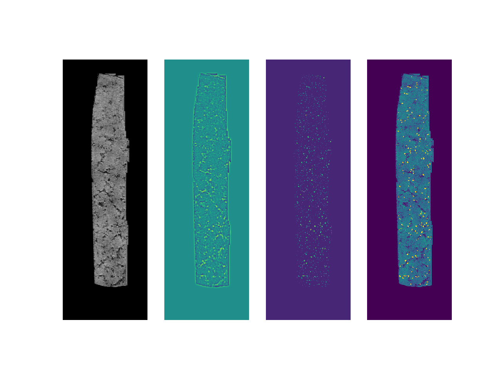
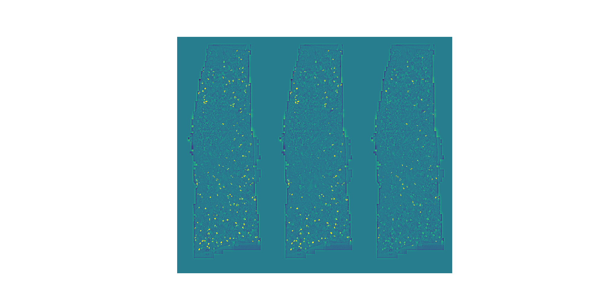

# HLoG-VBGMM 

## Requirements: 

- python >= 3.11.5
- libraries: numpy, matplotlib, pandas, skimage, scipy, os, argparse, SimpleITK, nibabel

## Description: 

HLoG-VBGMM is a state-of-the-art blob detector based on Laplacian of Gaussian (LoG), Hessian analysis, and Variational Bayesian Gaussian Mixture Model (VBGMM). This model was previously used by K. Bennett _et al._ to count glomeruli in contrast-enhanced MRI (CE-MRI).

Here, for the first time, the model was used to estimate the glomerular number and density of human _ex vivo_ kidney samples from ultra high-field MRI (16.4T) acquired at 30-micron isotropic resolution. 

## Dataset:

The dataset consists of six three-dimensional MRI acquired at 30-micron isotropic resolution, obtained from healthy portions of 6 nephroctomy samples from 4 distinct patients, and 6 masks delineating the tissue from the background. 

The MRIs and masks can be downloaded at: (add link)


## Project Structure 

HLoG_VBGMM/
│
├── HLoG_notebook.ipynb # Example notebook
│
├── input/ 
│ ├── sample_X.npy 
│ └── mask_X.npy 
│
├── output/ 
├── python/ 
│ ├── arguments.py 
│ └── main.py
│ └── utils.py 
│
├── README.md # Project overview and instructions
└── requirements.txt # Python dependencies

- **`input/`**
  Replace `X` with the sample identifier, such as `A`, `B`, `C`, `D`, or `E` (e.g. for sample A: `sample_A.npy` and `mask_A.npy`).

- **`output/`**
   Empty folder to save the masks generated when the segmentation is completed. 

## Run the model:

```
python main.py 'sample'
```

## Results

The figure below shows the different steps of the segmentation to obtain the blob candidates. The first image is an original MRI of a kidney sample acquired at 60 micron. The second image is the LoG filtered image at the optimum scale sigma. For details on how the parameter sigma is optimised, please refer to our paper. The third image represents the concave elliptical structure (potential glomeruli) detected by Hessian analysis. Finally, the last image shows the plausible blob candidates (in yellow), ie. the ones with the right size, on the original sample. 




The following figure allows to visualise the performance of the clustering with the Variational Bayesian Gaussian Mixture Model. On the left, we have all the blob candidates (in yellow) on the original MRI. In the middle, we have the final segmentation with all the glomeruli, and on the right, all the other blobs. 




